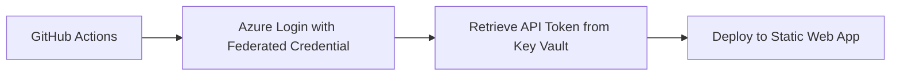

# Azure Static Web Apps - Key Vault Integration

## 🔐 Overview

This setup uses **Azure Key Vault** to securely store Static Web App API tokens and other secrets, reducing the number of GitHub Secrets from **8 to just 5**!

## 🎯 Benefits

✅ **Fewer GitHub Secrets** - Only 5 secrets instead of 8  
✅ **Centralized Secret Management** - All API tokens in one Key Vault  
✅ **Automatic Rotation** - Rotate secrets in one place  
✅ **Better Security** - Secrets never leave Azure  
✅ **Audit Trail** - Key Vault tracks all secret access

## 📋 Required GitHub Secrets (Only 5!)

| Secret Name             | Description               | Used By          |
| ----------------------- | ------------------------- | ---------------- |
| `AZURE_TENANT_ID`       | Azure AD Tenant ID        | All environments |
| `AZURE_SUBSCRIPTION_ID` | Azure Subscription ID     | All environments |
| `AZURE_CLIENT_ID_DEV`   | App Registration for Dev  | Dev workflow     |
| `AZURE_CLIENT_ID_TEST`  | App Registration for Test | Test workflow    |
| `AZURE_CLIENT_ID_PROD`  | App Registration for Prod | Prod workflow    |

**That's it!** No more API token secrets in GitHub.

## 🗄️ Secrets Stored in Key Vault

The following secrets are automatically stored in `kv-az-fluxline-next`:

### Dev Environment

- `swa-api-token-dev` - Static Web App API token
- `github-client-id-dev` - App Registration Client ID
- `environment-dev` - Environment identifier

### Test Environment

- `swa-api-token-test` - Static Web App API token
- `github-client-id-test` - App Registration Client ID
- `environment-test` - Environment identifier

### Prod Environment

- `swa-api-token-prod` - Static Web App API token
- `github-client-id-prod` - App Registration Client ID
- `environment-prod` - Environment identifier

## 🚀 Setup Process

### Step 1: Clean Up Old Resources

```powershell
cd azure
.\cleanup-old-resources.ps1
```

This will delete:

- ✅ Old Static Web Apps
- ✅ Old Managed Identities
- ✅ Old App Registrations

But **keeps**:

- ✅ Resource Group
- ✅ Storage Account
- ✅ VNets

### Step 2: Run Provisioning Script

```powershell
.\provision-swa-with-managed-identities.ps1
```

This will:

1. ✅ Create/verify Key Vault `kv-az-fluxline-next`
2. ✅ Create User-Assigned Managed Identities
3. ✅ Create Static Web Apps
4. ✅ Grant Key Vault access to Managed Identities
5. ✅ Store all secrets in Key Vault
6. ✅ Configure Federated Credentials for GitHub Actions

### Step 3: Configure GitHub Secrets

The script will output 5 secrets to add to your GitHub repository:

Go to: `https://github.com/Fluxline-Pro/fluxline-pro-next/settings/secrets/actions`

Add the 5 secrets shown in the script output.

### Step 4: Delete Old GitHub Secrets

Remove these old secrets (no longer needed):

- ❌ `AZURE_STATIC_WEB_APPS_API_TOKEN_DEV`
- ❌ `AZURE_STATIC_WEB_APPS_API_TOKEN_TEST`
- ❌ `AZURE_STATIC_WEB_APPS_API_TOKEN_PROD`

## 🔄 How It Works

### Workflow Flow



### Step-by-Step

1. **GitHub Actions starts** - Push to develop/test/master branch
2. **Azure Login** - Uses federated credential (OIDC)
3. **Get Token** - Retrieves API token from Key Vault using Azure CLI
4. **Deploy** - Uses token to deploy to Static Web App

### Code Example (from workflow)

```yaml
- name: Azure Login
  uses: azure/login@v2
  with:
    client-id: ${{ secrets.AZURE_CLIENT_ID_DEV }}
    tenant-id: ${{ secrets.AZURE_TENANT_ID }}
    subscription-id: ${{ secrets.AZURE_SUBSCRIPTION_ID }}

- name: Get API Token from Key Vault
  id: get-token
  run: |
    $token = az keyvault secret show --vault-name kv-az-fluxline-next --name swa-api-token-dev --query value -o tsv
    echo "::add-mask::$token"
    echo "SWA_TOKEN=$token" >> $env:GITHUB_OUTPUT
  shell: pwsh

- name: Deploy to Azure Static Web Apps
  uses: Azure/static-web-apps-deploy@v1
  with:
    azure_static_web_apps_api_token: ${{ steps.get-token.outputs.SWA_TOKEN }}
    # ... other settings
```

## 🔐 Security Features

### Token Masking

```powershell
echo "::add-mask::$token"
```

Ensures tokens are never printed in GitHub Actions logs.

### Key Vault Access Control

Each Managed Identity has access **only** to its environment's secrets:

- `az-fluxline-next-dev-mg` → Can read `swa-api-token-dev`
- `az-fluxline-next-test-mg` → Can read `swa-api-token-test`
- `az-fluxline-next-prod-mg` → Can read `swa-api-token-prod`

### Federated Credentials

- ✅ No long-lived secrets
- ✅ OIDC tokens expire in minutes
- ✅ Automatic token refresh per workflow run

## 🛠️ Maintenance

### Rotate API Token

```powershell
# Reset the token in Azure
az staticwebapp secrets reset-api-key `
    --name az-fluxline-next-dev `
    --resource-group az-fluxline-rg

# Get the new token
$newToken = az staticwebapp secrets list `
    --name az-fluxline-next-dev `
    --resource-group az-fluxline-rg `
    --query "properties.apiKey" -o tsv

# Update Key Vault
az keyvault secret set `
    --vault-name kv-az-fluxline-next `
    --name swa-api-token-dev `
    --value $newToken
```

**No GitHub changes needed!** The workflow automatically picks up the new token.

### View Secrets

```powershell
# List all secrets
az keyvault secret list --vault-name kv-az-fluxline-next --output table

# Get a specific secret value (requires permissions)
az keyvault secret show --vault-name kv-az-fluxline-next --name swa-api-token-dev --query value -o tsv
```

### Audit Access

```powershell
# View Key Vault activity logs
az monitor activity-log list `
    --resource-group az-fluxline-rg `
    --offset 1d `
    --query "[?contains(resourceType, 'KeyVault')]" `
    --output table
```

## 🐛 Troubleshooting

### Error: "Forbidden: Caller does not have permission"

**Cause:** Managed Identity doesn't have Key Vault access

**Solution:**

```powershell
$identityPrincipalId = az identity show `
    --name az-fluxline-next-dev-mg `
    --resource-group az-fluxline-rg `
    --query principalId -o tsv

az keyvault set-policy `
    --name kv-az-fluxline-next `
    --object-id $identityPrincipalId `
    --secret-permissions get list
```

### Error: "Secret not found"

**Cause:** Secret doesn't exist in Key Vault

**Solution:**

```powershell
# Re-run the provisioning script or manually add the secret
$apiToken = az staticwebapp secrets list `
    --name az-fluxline-next-dev `
    --resource-group az-fluxline-rg `
    --query "properties.apiKey" -o tsv

az keyvault secret set `
    --vault-name kv-az-fluxline-next `
    --name swa-api-token-dev `
    --value $apiToken
```

### Error: "The workflow does not have access to this vault"

**Cause:** GitHub Actions can't authenticate to Azure

**Solution:** Verify these GitHub Secrets are set:

- `AZURE_CLIENT_ID_DEV/TEST/PROD`
- `AZURE_TENANT_ID`
- `AZURE_SUBSCRIPTION_ID`

## 📚 Additional Resources

- [Azure Key Vault Documentation](https://docs.microsoft.com/en-us/azure/key-vault/)
- [Managed Identities](https://docs.microsoft.com/en-us/azure/active-directory/managed-identities-azure-resources/)
- [GitHub OIDC with Azure](https://docs.github.com/en/actions/deployment/security-hardening-your-deployments/configuring-openid-connect-in-azure)

## 🎉 Summary

**Before:**

- 8 GitHub Secrets
- Tokens scattered across GitHub
- Manual rotation process
- No central audit trail

**After:**

- ✅ 5 GitHub Secrets (3 fewer!)
- ✅ Tokens in Key Vault
- ✅ Rotate in one place
- ✅ Complete audit trail
- ✅ Better security posture

---

**Your secrets are now secured in Azure Key Vault! 🔐**
